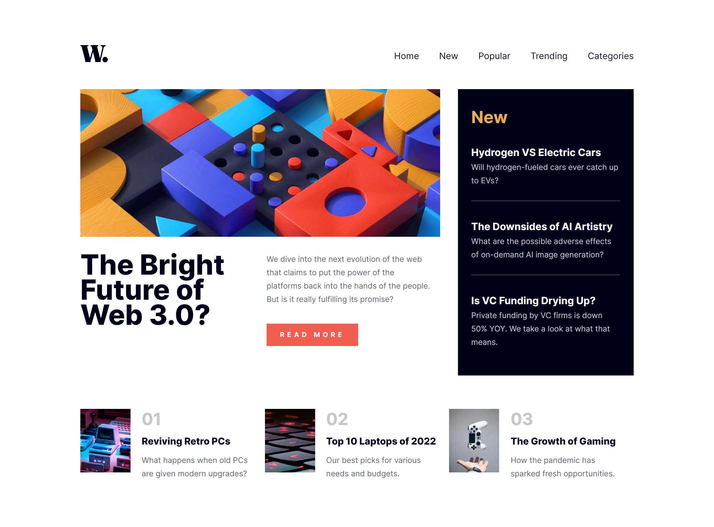
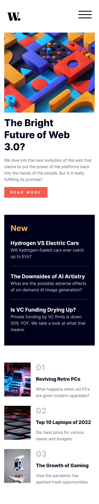

# Frontend Mentor - News homepage solution

This is a solution to the [News homepage challenge on Frontend Mentor](https://www.frontendmentor.io/challenges/news-homepage-H6SWTa1MFl). Frontend Mentor challenges help you improve your coding skills by building realistic projects. 

## Table of contents

- [Overview](#overview)
  - [The challenge](#the-challenge)
  - [Screenshot](#screenshot)
      - [Desktop](#desktop)
      - [Mobile](#mobile)
  - [Links](#links)
- [My process](#my-process)
  - [Built with](#built-with)
- [Author](#author)

## Overview

### The challenge

Users should be able to:

- View the optimal layout for the interface depending on their device's screen size
- See hover and focus states for all interactive elements on the page

### Screenshot

#### Desktop

#### Mobile

### Links

- Solution URL: [My solution on Frontend Mentor](https://www.frontendmentor.io/solutions/news-homepage-using-nextjs-GpE8x3eByQ)
- Live Site URL: [See my solution running](https://news-homepage-eight-mu.vercel.app/)

## My process

### Built with

- Semantic HTML5 markup
- Flexbox
- Mobile-first workflow
- [React](https://reactjs.org/) - JS library
- [Next.js](https://nextjs.org/) - React framework
- [Tailwind CSS](https://tailwindcss.com/) - For styles

## Author

- Frontend Mentor - [@nascimentolds](https://www.frontendmentor.io/profile/nascimentolds)

